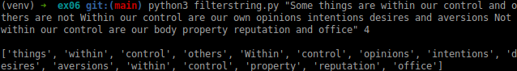

# python-for-data-science

## Description
The "Training Piscine Python for Data Science" is a structured program that introduces Python programming through a series of exercises, each focused on building different coding skills. 

## Content
### 0-starting:
* Exercise 00: Print greetings in various formats using lists, tuples, sets, and dictionaries.
* Exercise 01: Format and display the current date and time in a specific format using libraries like time or datetime.
* Exercise 02: Write a function to identify and print the types of various objects.
* Exercise 03: Handle different types of null values (None, NaN, 0, empty string, etc.) and return appropriate outputs.
* Exercise 04: Create a program that checks if a number is even or odd and handles errors for invalid inputs.
* Exercise 05: Build a program that counts different types of characters (uppercase, lowercase, digits, etc.) in a given string.
* Exercise 06: Implement a custom ft_filter function and create a program that filters words based on length, using list comprehensions and lambda functions.

* Exercise 07: Convert a string into Morse code, handling space and alphanumeric characters with a dictionary lookup.
* Exercise 08: Recreate the tqdm progress bar functionality using Python's yield operator.
* Exercise 09: Create a Python package and make it installable via pip.

## Tools
### Flake8
Flake8 is a tool for checking the style and quality of Python code. It combines several tools into one, including:<br />
* PyFlakes: Checks for logical errors in Python code.
* pycodestyle (formerly known as Pep8): Checks for compliance with the PEP 8 style guide, which is the official style guide for Python code.
* McCabe: Checks the complexity of the code, specifically cyclomatic complexity.

```
// Installation
pip install flake8

// Usage (target can be '.' or an entire folder
flake8 <target>
```
